# 🚀 Wambua Christopher Ngumbi
  

## 👋 About Me
I am a Software Engineer with a solid background in ICT, data analytics, and systems development. My work centers on building efficient, scalable, and user-centered solutions to real-life problems.

I am always curious and committed to learning, so I explore new technologies and look for creative ways to solve business and technical problems. I believe that using fresh ideas and modern methods helps systems and organizations move forward.

As an ICT professional, I have worked in system management, operational support, and data administration. I am good at solving problems, pay close attention to detail, and have a track record of keeping systems reliable and efficient.

I enjoy working with others and value discussing ideas and improving together. I look for chances to share ideas and help achieve good results with technology.

My entrepreneurial experience has strengthened my strategic thinking, initiative, and adaptability. It helps me meet challenges using a problem solving mindset and concentrate on long term results. I am devoted to staying up to date with new technology and joining teams where I can learn and make a real difference.

---

## 🛠️ Tech Stack
- **Languages:** JavaScript, TypeScript, YAML, Python, C, Assemby
- **Web Technologies:** HTML, CSS, SASS  
- **Tools & Platforms:** Git, GitHub, Linux, Docker, kubernetes
- **Other Skills:** Networking, Systems Administration, Systems Analysis, Data Analysis, Computer Engineering, Database Management 

---

## 📌 Featured Projects
Explore my work and projects on GitHub:
 
### 1. [Euler](https://github.com/cngumbi/Euler)  
C programming projects with algorithmic challenges and problem-solving exercises.  
  
### 2. [Statistical_Analysis](https://github.com/cngumbi/Statistical_Analysis)  
R projects demonstrating data cleaning, visualization, and statistical analysis.  

🔗 [My GitHub Profile](https://github.com/cngumbi)

---

## 📊 GitHub Stats

---

## 📫 Contact Me
- 📧 Email: Wambuangumbi@gmail.com  
- 📞 Phone: +254 798 401 034
- 📞 Office: +254 756 478 936
- 🌍 Location: Utuneni, Ngiluni, Tulimani, Mbooni West, Makueni  

---

## 🎯 Career Objective
To employ my technical skills and enthusiasm for software engineering to build innovative, modular solutions, contribute to valuable projects, and continuously grow within the technology industry.

---

## 💡 What I Bring
- Strong analytical and problem-solving skills  
- Adaptability and continuous learning mindset  
- Experience in ICT systems and technical operations  
- Entrepreneurial thinking and initiative  
- Effective communication and teamwork  

---

## ⚡ Let's Build Something Great
I am open to collaboration, freelance opportunities, and full-time roles in software development and IT.

Feel free to connect or reach out!
